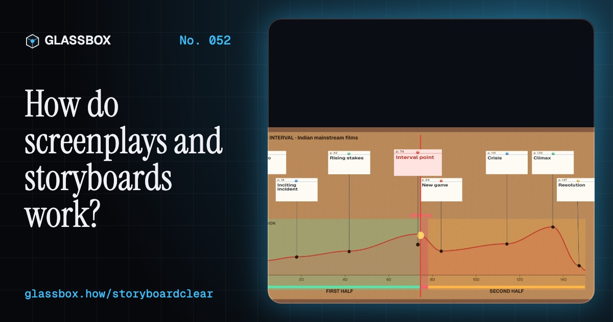
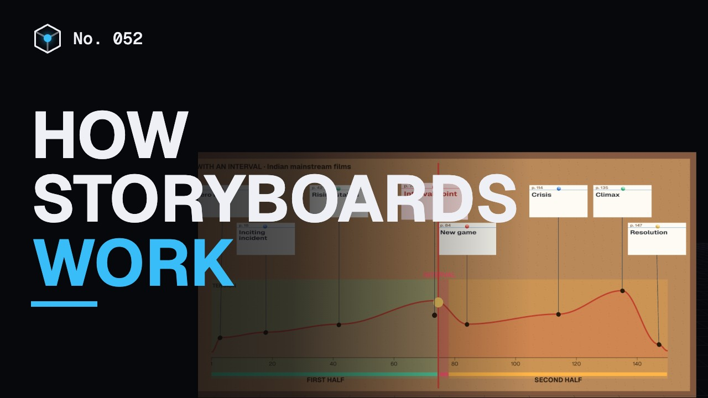
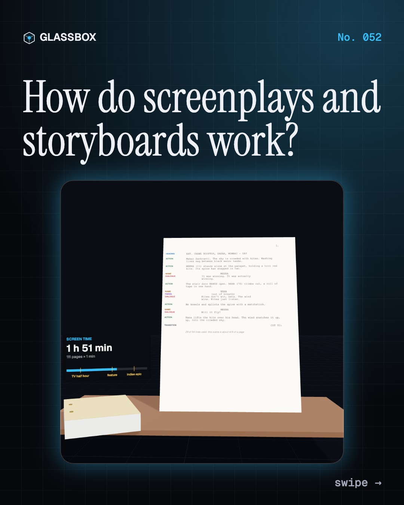
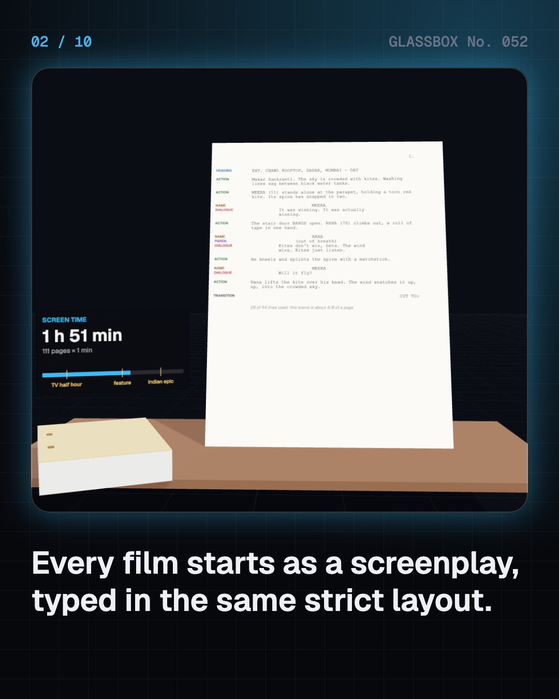
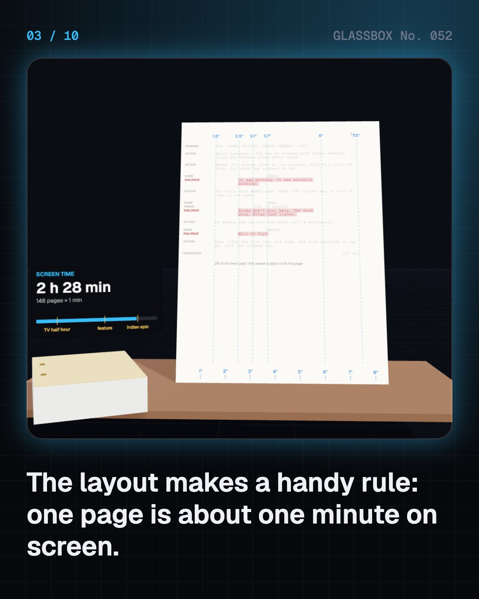
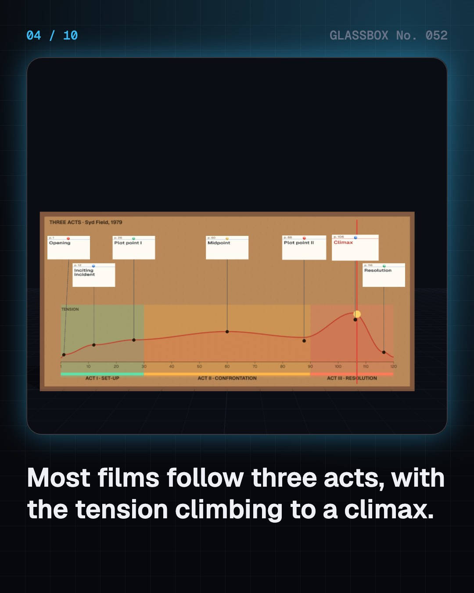

<!-- glassbox:start -->
<!-- Generated from glassbox.json by the Glassbox hub (npm run readme -- storyboardclear). Edit glassbox.json, not this block. -->
<p align="center"><a href="https://glassbox.how/e/storyboardclear/"></a></p>

<h1 align="center">StoryboardClear</h1>

<p align="center"><b>How do screenplays and storyboards work?</b><br>Before a camera rolls, a film already exists twice: as a script where one page is about one minute, and as a comic strip of every shot. Write a scene, board it from a 3D camera, cross the 180-degree line and play your own animatic.</p>

<p align="center"><a href="https://glassbox.how/storyboardclear/"><b>▶ Play with it</b></a> &nbsp;·&nbsp; <a href="https://glassbox.how/e/storyboardclear/">Read the 60-second explainer</a> &nbsp;·&nbsp; <a href="https://glassbox.how/storyboardclear/glassbox/reel.mp4">Watch the 40-second video</a></p>

<p align="center">
  <a href="https://glassbox.how/e/storyboardclear/"></a>
  <a href="https://glassbox.how/e/storyboardclear/"></a>
  <a href="LICENSE"></a>
  <a href="LICENSE-CONTENT.md"></a>
  <a href="#privacy"></a>
</p>

## In 60 seconds

1. **A script is a timed blueprint.** Screenplays use 12-point Courier and fixed margins for headings, action, names and dialogue, so one page runs about one minute. A 110-page script makes a film of roughly two hours.
2. **Stories have a shape.** Most films follow three acts: set-up, confrontation, resolution, with turning points that push the tension up to a climax. Indian films add an interval, with a big twist just before it.
3. **Words become pictures.** A storyboard draws every shot. Each one picks a shot size, from extreme wide to extreme close-up, an angle such as low, high or Dutch, and a move such as a pan, tilt, dolly or track.
4. **Coverage and the line.** A scene is filmed from several set-ups: a master, over-the-shoulders and close-ups. Keep every camera on one side of the line between two characters, or they swap sides on screen.
5. **Timing before shooting.** An animatic plays the panels in time with temp sound. Pre-vis rebuilds the scene in simple 3D, as big action films like Baahubali and RRR did, so costly shots are solved on a computer first.
6. **You direct.** Board a six-shot scene yourself. A checklist catches the classic mistakes: no establishing shot, jump cuts, a crossed line, no close-up, or a scene that runs far longer than its page count.

## Words worth knowing

| Term | Meaning |
|---|---|
| **Screenplay** | A film script in a standard layout: 12-point Courier, fixed margins, roughly one page per minute of screen time. |
| **Scene heading** | The line that opens a scene: INT. or EXT., the place and the time of day, such as EXT. ROOFTOP - DAY. |
| **Three-act structure** | Set-up, confrontation and resolution, split roughly a quarter, a half and a quarter of the script. |
| **Storyboard** | A sequence of drawings, one per shot, showing what the camera will see. |
| **Shot size** | How much of the subject fills the frame: extreme wide, wide, medium, close-up or extreme close-up. |
| **Coverage** | Filming one scene from several set-ups, such as a master, over-the-shoulders and close-ups, so the editor has choices. |
| **180-degree rule** | Keep the camera on one side of the line between two characters so each stays on the same side of the screen. |
| **Animatic** | Storyboard panels cut together in time with rough sound, to test a scene's rhythm. |
| **Pre-vis** | Previsualisation: planning shots with a simple 3D model of the set, actors and cameras before shooting. |

## A short history

**120 years from Méliès's list of magic tableaux to scripts in plain text and whole films rehearsed inside a computer.**

- **1902** · A trip to the Moon in 30 tableaux (Georges Méliès, Montreuil, near Paris, France)
- **1913** · The continuity script (Thomas H. Ince, Inceville, Los Angeles, USA)
- **1933** · Drawings pinned to a wall (Webb Smith, Walt Disney Productions, Hyperion studio, Los Angeles, USA)
- **1939** · Gone with the Wind is drawn shot by shot (William Cameron Menzies, for David O. Selznick, Culver City, California, USA)
- **1955** · The page that equals a minute (Hollywood studios and writers, Hollywood, USA)
- **1955** · Pather Panchali in a sketchbook (Satyajit Ray, Calcutta (now Kolkata), India)
- **1960** · The shower scene on paper (Saul Bass and Alfred Hitchcock, Universal Studios, Los Angeles, USA)
- **1973** · Writers' names on the posters (Salim–Javed (Salim Khan and Javed Akhtar), Bombay (now Mumbai), India)

The full story, with 30 moments, charts, people and 47 sources: [glassbox.how/e/storyboardclear/history](https://glassbox.how/e/storyboardclear/history/). The data lives in [`history.json`](history.json).

## Video and slides

Made with the Glassbox studio from this box's storyboard (`window.glassbox.director`). Free to reuse under CC BY 4.0.

<a href="https://glassbox.how/storyboardclear/glassbox/video.mp4"></a>

<p><a href="glassbox/slide-1.jpg"></a> <a href="glassbox/slide-2.jpg"></a> <a href="glassbox/slide-3.jpg"></a> <a href="glassbox/slide-4.jpg"></a></p>

| File | What | Size |
|---|---|---|
| [`glassbox/reel.mp4`](https://glassbox.how/storyboardclear/glassbox/reel.mp4) | Reel / Short, with captions and soundtrack | 1080×1920 |
| [`glassbox/video.mp4`](https://glassbox.how/storyboardclear/glassbox/video.mp4) | YouTube video, with captions and soundtrack | 1920×1080 |
| `glassbox/slide-1…10.jpg` | Instagram carousel | 1080×1350 |
| `glassbox/thumb.jpg` | YouTube thumbnail | 1280×720 |
| `glassbox/cover.jpg` | Share card and repo social preview | 1200×630 |
| [`glassbox/history-reel.mp4`](https://glassbox.how/storyboardclear/glassbox/history-reel.mp4) | “History in 10 moments” Reel / Short | 1080×1920 |
| `glassbox/history-slide-*.jpg` | History carousel | 1080×1350 |
| `glassbox/post.json` | Post copy and schedule used by the publish kit | |

## Privacy

This box has no accounts and no ads, and it ships its own fonts and libraries. When you run it yourself it sends nothing anywhere. On glassbox.how, the site's `/bar.js` also loads Glassbox's analytics: **Google Analytics** to count visits (it asks first in the EU, UK and Switzerland, and stays off when your browser sends Global Privacy Control or Do Not Track) and **ClickTrust** to detect bots.

It remembers a few things **in your own browser only**, and never sends them anywhere:

| Browser storage key | What it holds |
|---|---|
| `storyboardclear.v1` | Which chapters you have opened, your best quiz scores, and sound on or off. |

Exactly what each one sees is at [glassbox.how/privacy](https://glassbox.how/privacy/).

## Licences

- **Code:** [MIT](LICENSE). Use it, change it, ship it.
- **Explanations, text, images and videos** (`glassbox.json`, `glassbox/`): [CC BY 4.0](LICENSE-CONTENT.md). Credit “Glassbox, glassbox.how/e/storyboardclear”.
- **Third-party parts** keep their own licences: [three.js](https://threejs.org) (MIT), [Geist, Instrument Serif](https://openfontlicense.org) (SIL OFL 1.1).
- The Glassbox name and logo aren't covered by either licence. See the [terms](https://glassbox.how/terms/).

Found a mistake? [Open an issue](https://github.com/bdeeps/storyboardclear/issues). Corrections happen in public.
<!-- glassbox:end -->

## Run it

It's plain HTML, CSS and JavaScript. No build step and no dependencies. Run locally, it contacts no other website.

```bash
python3 -m http.server 8000
```

Three.js and the fonts ship in `vendor/` and `fonts/`, so it also works offline.

Then open http://localhost:8000.

## How it's built

| File | What |
|---|---|
| `index.html`, `css/app.css` | The page and its styles |
| `js/app.js`, `js/stage.js`, `js/ui.js`, `js/kit.js` | The shared Glassbox 3D engine: chapters, 3D stage, controls, quiz, video director |
| `js/chapters/*.js` | One file per chapter: the 3D model, controls, text, key terms, quiz and video scenes |
| `js/story.js` | Shared parts: the Mumbai rooftop set, faceless mannequins and the kite, a virtual 35 mm camera framed by shot size and angle, and storyboard panels that render its view as a pencil sketch |
| `glassbox.json` | Title, question, explainer beats, key terms, browser storage and credits shown on glassbox.how |
| `reel` in each chapter | The storyboard the Glassbox studio records into short videos |
| `glassbox/` | The published video, slides, thumbnail and post copy |
| `fonts/`, `vendor/three/` | Self-hosted Geist and Instrument Serif (SIL OFL 1.1) and three.js (MIT) |
